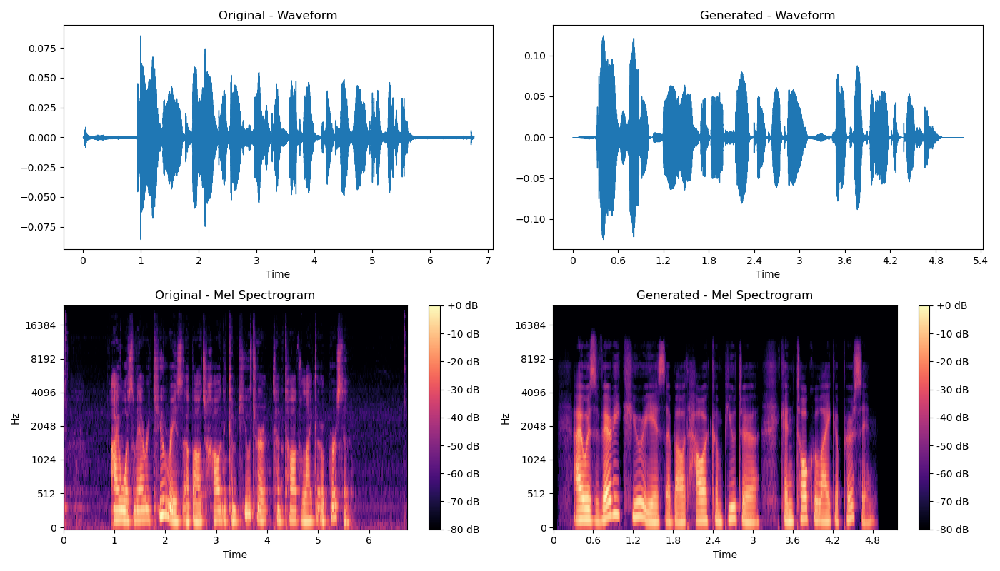

### Voice_Clone
Voice clone demo. In this repo, I used a model called GPT-SoVITS to clone my own voice. I will cover a little about literature and then we will go a step by step tutoria how I cloned my voice. I wanted to understand it like a complex machine, to see how all the parts work together.

## Literature Review: Advances in Voice Cloning and Zero-Shot TTS

# Overview
Voice cloning, formally known as Multi-Speaker Text-to-Speech (TTS) or Zero-Shot TTS, aims to synthesize speech in the voice of a target speaker using limited reference audio (ranging from a few seconds to a few minutes).

# Technological Evolution
The field has evolved rapidly through three distinct paradigms over the last few years:

Phase I: Voice Conversion / RVC 
While Retrieval-based approaches (like RVC) achieve high fidelity by retrieving and reconstructing acoustic features from a reference database, they are fundamentally Speech-to-Speech (STS) systems that require source audio input.

Phase II: Cascaded Systems & RNNs (2017–2019)

Phase II of voice cloning, labeled as the Cascaded Systems & RNNs Era (2017–2019), marked the initial major adoption of deep learning in Text-to-Speech (TTS) and established the foundational two-stage pipeline for neural synthesis. 

The most famous example is Tacotron 2 from Google. I think a good way to understand it is like a two-step factory process:

1. Text to Picture: First, the model reads the text you give it. It does not make sound directly. Instead, it creates a special kind of picture of the sound. This picture is called a mel-spectrogram. It's like a musical score for speech, showing which frequencies (low or high pitch) are loud at each moment in time (It is a time-frequency domain representation of the sound). This is much simpler for AI to create than the complex final sound wave. 

2. Picture to Sound: After the picture is made, it goes to a second model. This model is called a vocoder. A famous vocoder is WaveNet. The vocoder's only job is to look at the mel-spectrogram picture and generate the actual audio waveform from it.

The big problem was that this method was very, very slow. The WaveNet vocoder had to generate the audio one sample at a time. This is called an "autoregressive" process, meaning it creates the audio step-by-step, where each new sample depends on the one generated just before it. Because audio has thousands of samples every second （For example, CD quality sample rate is 44Khz）, this is like building a car one screw at a time—very precise, but incredibly slow.

This slowness and the two-part complexity were the main engineering problems that the next generation of models had to solve.

SV2TTS / Real-Time Voice Cloning (Jia et al., Google, 2018)

Making It Faster and Better: Non-Autoregressive and End-to-End Models

Engineers saw the problems with the cascaded systems and designed direct solutions to make TTS faster and more efficient. This section is about these clever engineering improvements.

Here are some of the key improvements from the newer models:

* FastSpeech 2: The main idea of this model is to stop generating audio sample-by-sample. Instead, it predicts how long each sound (phoneme) in the text should be before it generates the spectrogram. This allows it to generate the whole mel-spectrogram picture all at once, in parallel, which is much faster. It also has a special part called a "Variance Adaptor." This module adds more realistic details like pitch, energy, and duration to the speech. This gives the user more control to change how the final voice sounds.
* VITS (Variational Inference with adversarial learning for Text-to-Speech): This model was a major improvement. The creators of VITS had a very smart idea: why not make it just one big model instead of two separate steps? VITS is an "end-to-end" model that combines the text-to-picture and picture-to-sound jobs into a single network, making a separate vocoder unnecessary. From a systems view, this is a big deal. It is like replacing two separate machines on an assembly line with one integrated machine that does both jobs. This is always more efficient, and the final audio quality is even better. To do this, it uses some very advanced AI methods like Variational Autoencoders (VAEs) and Generative Adversarial Networks (GANs).

These models made the text-to-spectrogram pipeline much better, but soon researchers integrates the pipeline into a single end-to-end model.

Phase III: Non-Autoregressive & End-to-End Models (2019–2021)

A New Paradigm: Speech as a Language Modeling Problem

This next part I think is a paradigm shift. While earlier models were trying to make the same system faster (text -> spectrogram -> audio), researchers suddenly changed the whole idea. Everyone knows about Large Language Models (LLMs) like GPT that are very good at creating text. So, researchers started to apply the exact same idea to create audio. They threw out the spectrogram pipeline and started thinking about sound like a language.

The most famous model that does this is VALL-E from Microsoft. The core innovation of VALL-E is that it does not create a mel-spectrogram "picture" at all. Instead, it uses another AI model called a neural audio codec to turn audio into a sequence of discrete numbers, which they call "codes" or "tokens." This idea of turning audio into a discrete, language-like representation was revolutionary. Just like we can break down a sentence into a sequence of words, VALL-E breaks down a sound into a sequence of "sound-words."

This new approach gives VALL-E some amazing abilities:

* In-Context Learning: This is its most famous feature. VALL-E can learn to clone a new voice from just a 3-second audio recording. This short recording, along with its text transcription, is called an "acoustic prompt."
* Zero-Shot TTS: This means the model can create speech for a speaker it has never been trained on before, without any fine-tuning. It just needs the 3-second prompt.
* Massive Data Requirement: Here is the big challenge. To get these amazing abilities, VALL-E was trained on 60,000 hours of speech data. This is hundreds of times larger than any TTS model before it. This amount of data and computer power is not practical for most people or small companies.

Because VALL-E is so big, we need a practical model that uses these new ideas but is more accessible. This brings us to GPT-SoVITS, which is a very clever engineering trade-off.
 
## GPT-SoVITS

Concept: A hybrid approach combining the strengths of LLMs and VITS.

Architecture: Uses a GPT model to predict prosody/semantic features and a VITS decoder to generate the final waveform.

A Practical Model We Can Use: GPT-SoVITS

For my project, I was most interested in GPT-SoVITS. It is a very exciting open-source project that shows how to make a practical tool that is the best of both worlds. It solves VALL-E’s huge data requirement by cleverly integrating its language-modeling concept with the proven high-fidelity synthesis of VITS. It is especially good for cloning a voice with very little data.

The architecture is a clever two-stage system.

 Stage 1: The GPT for Prosody (Text-to-Semantic)

The first part of the system is a GPT model. This is the "brain" of the operation. It takes two inputs: the text you want the model to say, and a short 3-10 second reference audio clip of the target voice. This model adopts the "language modeling" idea from VALL-E, but it applies it more narrowly. Its job is not to create the sound itself. Instead, it predicts a sequence of "semantic tokens." These tokens represent the rhythm, emotion, and prosody of the speech—basically, how the words should be spoken to sound natural for that person.

 Stage 2: SoVITS for Sound (Semantic-to-Acoustic)

The second part of the system is the "mouth" that actually produces the sound. It takes the semantic tokens produced by the GPT model as its primary input. Using these instructions on rhythm and prosody, the SoVITS decoder generates the final, high-quality audio waveform. This stage makes sure the audio has the correct vocal characteristics, or timbre (the unique quality that makes a voice sound like a specific person), of the target speaker from the reference audio. To do this, it leverages the same end-to-end VAE and GAN architecture pioneered by VITS to ensure the final sound is high-quality.

The biggest advantage of GPT-SoVITS is how well it works on "low-resource" situations. It only needs about 1 minute of audio data from a speaker to produce very good voice cloning results. This is a huge difference from the 60,000 hours needed for VALL-E and makes it a very practical and powerful tool for personal use.

## Model training process

The overall goal of this process is to fine-tune a massive pre-trained model to clone a specific voice using only a minimal custom dataset (e.g., 1 minute of data), utilizing the strengths of transfer learning.

# Step 1 & 2: Data Preparation (Recording and Splitting)
I began by creating and preparing the custom audio data needed for fine-tuning.
• Recording: I prepared a custom dataset containing approximately 1 minute of English speech data.
• Slicing: The raw audio was sliced into short segments (2 to 10 seconds). This preprocessing step was critical because I used a local machine with limited memory (6GB VRAM). Slicing the audio into shorter segments helped manage GPU memory constraints and prevent CUDA Out-Of-Memory (OOM) errors.

# Step 3: Speech to Text and Phoneme Conversion (Labeling)
Accurate transcription and phonetic conversion were necessary to provide the text input needed for the GPT module (T2S stage).
• ASR Labeling: I used OpenAI Whisper (Small model) to perform Automatic Speech Recognition (ASR), generating accurate text labels for each audio slice.
• G2P Conversion: I used the g2p_en library to convert the English text labels into phonemes. The phonemes serve as the foundational text prompt for the GPT model.
Feature Extraction (Pre-Training Component)
Although not a manual step in my outline, the system automatically ran feature extraction before fine-tuning could start:
• Semantic Vectors: The raw audio was processed by the HuBERT (Hidden Unit BERT) model, a pre-trained component used to extract semantic vectors. This process is crucial because it disentangles the content (the words being spoken) from the timbre (the specific sound of my voice).
• Acoustic Features: A Mel-spectrogram extractor was also used to derive the necessary low-level acoustic features.

# Step 4 & 5: Training the Model (Sequential Fine-Tuning)
This constituted the core training phase, utilizing transfer learning from a massive pre-trained model (trained on 2000+ hours of multilingual data). Due to my hardware constraints, I implemented specific optimizations:
• Hardware Configuration: I used the AdamW optimizer and enabled FP16 (Half Precision) training to reduce memory consumption and accelerate computation. The Batch Size was reduced to 4 to prevent OOM errors.
The fine-tuning was carried out in two sequential steps:
Training Step
Module Fine-Tuned
Goal and Epochs
Learning Rate
SoVITS Training
VITS-based Decoder (S2A)
This step adapted the VITS decoder to the target speaker's acoustic characteristics (timbre). Fine-tuned for 8 epochs.
 
GPT Training
Autoregressive Transformer (T2S)
This step taught the model the specific speaking rhythm and prosody of my voice. Fine-tuned for 10 epochs.
 
The VITS module is essential because it is an end-to-end flow-based model utilizing a Conditional Variational Autoencoder (VAE) trained with Adversarial Learning (GAN), which is responsible for converting the semantic features into a high-fidelity raw waveform, thus guaranteeing the reconstruction of the speaker's specific timbre (Voiceprint).

# Step 6: Creating Speech (Inference)
Once the GPT module and the SoVITS decoder were fine-tuned, the final step was to generate new speech (inference).
• Input: The system requires the new text (in the form of phonemes) and a short acoustic prompt (e.g., 3–10 seconds of my voice).
• Process: The fine-tuned GPT module predicts the prosody and semantic features (T2S stage). These predicted features, along with the acoustic embedding extracted from the prompt, are fed into the VITS-based decoder (S2A stage). The decoder generates the final waveform, ensuring high-fidelity sound quality and accurate reproduction of my voice.

Now I will share my final thoughts on this technology.

# My Conclusion and Thoughts

In this report, I examined the evolution of Text-to-Speech technology. It has been a fast journey, from the slower, two-stage systems like Tacotron 2 to faster and more advanced models such as FastSpeech 2 and the integrated, end-to-end VITS. Now, we are in a new era with large language models for audio, like VALL-E, which completely changed the problem by treating audio like text tokens. The model I studied, GPT-SoVITS, demonstrates how these powerful ideas can be combined into a practical tool that anyone can use.

I find the system design very clever. They take different modules, like an engine and a transmission in a car, and combine them in smart ways to create something new and much better. The GPT-SoVITS model is a great example of this, using a GPT-style model for prosody and a VITS model for sound quality. Hearing my own generated voice for the first time was extremely exciting.

One major challenge I noticed is the importance of data quality. For a model like GPT-SoVITS to work well, the one minute of audio you provide must be very clean, with no background noise. This is a practical engineering problem that users need to solve to achieve good results.

Another challenge is setting up the toolchain. I learned how to use Conda to manage my Python environment and libraries.

Audio example：

<audio controls>
  <source src="output_audio/tts_survy_A02.mp3" type="audio/mp3">
</audio>

<audio controls src="output_audio/tts_survy_A02.mp3"></audio>

Compare:

1. References

* Tacotron 2: "Natural TTS Synthesis by Conditioning WaveNet on Mel Spectrogram Predictions"
* FastSpeech 2: "FastSpeech 2: Fast and High-Quality End-to-End Text to Speech"
* VITS: "Conditional Variational Autoencoder with Adversarial Learning for End-to-End Text-to-Speech"
* VALL-E: "Neural Codec Language Models are Zero-Shot Text to Speech Synthesizers"
* GPT-SoVITS Project GitHub page

